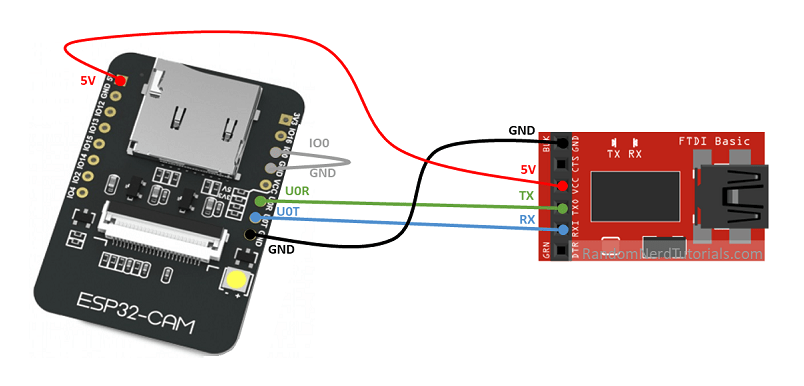

# Security service

### Requirements
1. `brew install --cask arduino`
2. ESP32 boards manager: `https://raw.githubusercontent.com/espressif/arduino-esp32/gh-pages/package_esp32_index.json`

### How to use 

Upload the sample code:

Example -> ESP32 -> Camera -> WebServer

From the Arduino IDE:

Tools -> Board -> AI Tinker or relative model
Tools -> Port -> the connected port

After uploading the code, disconnect the grey cable GND - GPIO
Press the RST reset button on the board.

Monitor on baud 115200 and visit the localhost url provided

More info here: https://randomnerdtutorials.com/esp32-cam-video-streaming-face-recognition-arduino-ide/