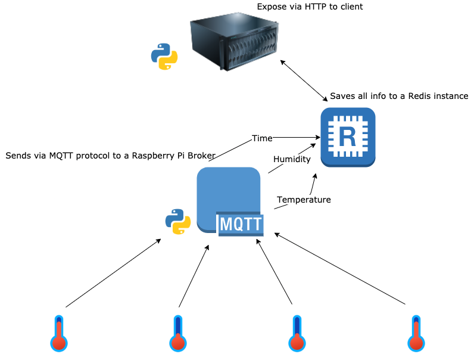

## Smarthome Hub

The smarthome hub is a MQTT broker that listens to a topic 'home/+/+' and reports temperature, humidity, date.

This information is served via a flask REST API to a client

### Check the status of the MQTT broker
Mosquitto should start automatically but you can always check its status, restart, stop etc. with one of these commands: 

- `sudo systemctl status mosquitto`
- `sudo systemctl start mosquitto`
- `sudo systemctl stop mosquitto`
- `sudo systemctl restart mosquitto`
- `sudo systemctl enable mosquitto`

### How to run the mqtt consumer
- `python3 mqtt.py`

### How to run the HTTP server
- `python3 main.py`